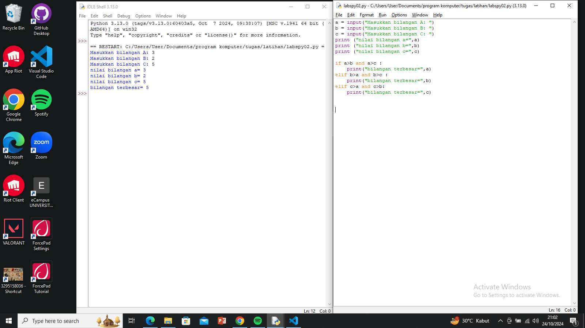
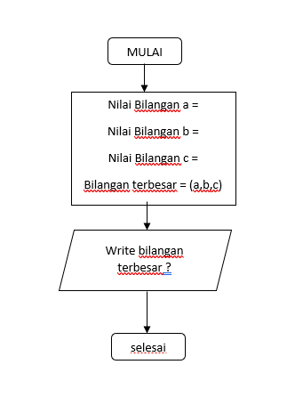

# labspy02
Tugas Praktiikum 2

NAMA    : DZIKRI YANUAR PAMUNGKAS

NIM     : 352311124

KELAS   : IE.23.C.12

## Membandingkan 3 bilangan 

mencari bilangan terbesar dari 3 bilangan

## Screenshots

### langkah Langkah algoritma
1. membuat program terlebih dahulu
2. pada idle python kita buat langkah program seperti di gambar screenshot tersebut
3. kita run program
4. kita masukan nilai yang kita inginkan pada bilangan tersebut
5. otomatis program akan membaca nilai bilangan terbesar

## Flowchart 

